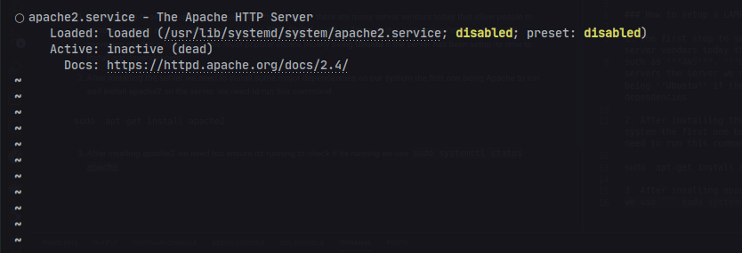
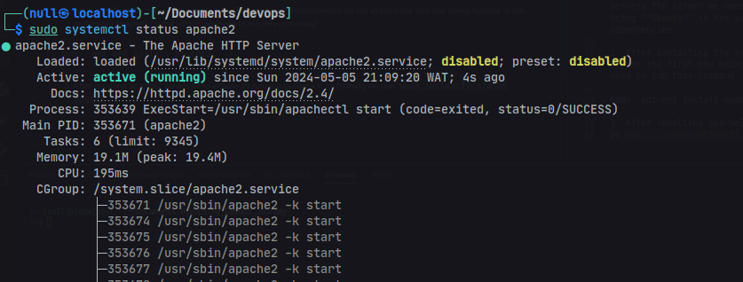
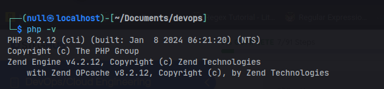

# LAMP 101


Linux Apache Mysql and Php are part of the many web stack that are used too power the web today according to data LAMP powers 70% of the website as we know of its today

### How to setup a LAMP stack for your application

1. #### The first step to setting up a LAMP stack is getting a server there are many server vendors today that allow people to borrow/rent their server infrastructure
    such as ***AWS***, ***Digital ocean*** or ***Azure*** all this companies rent up servers the server we need is a linux server the most popular choice mostly being **Ubuntu** if the server has been setup its time to install our dependencies

    assuming we using **AWS** we are going to have to setup an amazon EC2 insance also known as a server which we can rent from amazon
2. #### After installing the server we need to install some major dependencies on our system the first one being Apache to run and install apache2 on the server. we need to run this command

    ``` bash
    $ sudo  apt-get install apache2
    ```

3. #### After insalling apache2 we need too ensure its running to check if its running
    we use the following command

    ```bash
    $ sudo systemctl status apache
    ``` 

    

    if the status shows disable as shown below we might need to turn on the apache web server

    ```bash 
    $ sudo systemctl start apache
    ``` 
    to confirm the server is running we can run systemctl status all over again

     

    there we can clearly see the server is running this allows us too run the curl command on the server from our ***CLI*** using

    ```bash 
    $ curl http:://localhost:80
    ``` 
        or
    ```bash
    $ curl http://<IP_ADDRESS>:80
    ```

4. #### Another dependency we need to install and setup is **MYSQL** to install Mysql
    to do so we need to run the following command
    ```bash
    $ sudo apt-get install -y mysql-server
    ``` 

    this ensures we install mysql without a prompt asking if we truly need to install it 

    we can ***sudo*** into its using
    ```bash
    $ sudo mysql
    ```


    this allows us too get logged in as a root admin user but it is advisable never to work as an admin user while working on a database each database can have its own separate database user that works independently and given permission accordingly too work on the database

    too ensure essential security in our mysql database we need to run the following command 

    ```sql alter_user 
    ALTER USER 'root'@'localhost' IDENTIFIED WITH mysq_native_password BY <password>
    ```
    this allows us to enter login our database user as root

    ``` bash
    $ sudo mysql_secure_installation
    ```

    will allow us too add additional security to our mysql server securing our sql installation for the first prompt it will ask us how we wish to write our sql password depending on our choice for the rest of the choices provided we can hit y on our keyboard to secure our sql server and. And this conclude setting up our server


5. #### The last dependency to complete our setup is PHP
    to setup php we need to install its using the following command
    
    ```bash
    $ sudo apt-get install -y php libapache2-mod-php php-mysql
    ```
    allows us too install php including some other dependencies the lib-apache2 allows apache to handle php files while php-mysql is a mysql drive for php that allows us run mysql inside of php

    to confirm we've successfully installed my php we can use the below command
    ```bash
    $ php -v
    ```
    

    if this shows it means php has been successfully installed on our ubuntu server

This concludes our **LAMP** setup