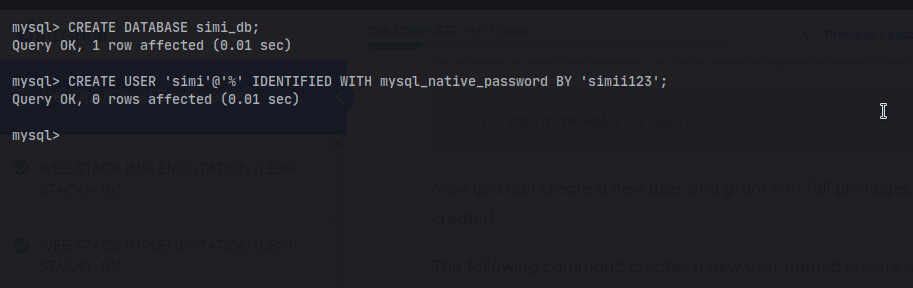

<!-- @format -->

# LEMP101 Setup

### Introduction

**In this module we are going to cover setting up LEMP 101 has taught from
steghub The LEMP Stack is another popular tech stack like the LAMP stack it
stands for \***Linux (E)Nginx Mysql Php**\* Nginx is another powerful webserver
like the Apache but unlike the Apache webserver it can only be used for serving
static content too the web Nginx is also very much widely used in the
eco-system.**

## Step 1 setup Linux server

1. ### An EC2 instance of t2.micro running Ubuntu Server 24.04 LTS (HVM) SSD Volume Type has been setup called nginix server

 

2. ### After we that we create our ssh key this keys gives us access to our login into our instance


this key need to be protected and only the owner need too have access to the key

3. ### After that we configure our network security group settings by default ssh port is being set in the instance this allows us too easily ssh into our server

   - then we can set our server to listen on port 443 to allow https traffic
   - secondly we allow our server to listen port 80 to allow http traffic

   

   ### then we also config the storage to be 30GB

   

after going through all this step we click on launch instance this then lauch
our instance making our server readily available for us. This conclude our step
on launching a server.

## step 2 Installing (E)nginx

before we begin installing **_Nginx_** we need too first ssh into our server,and
before we ssh into our server we need to first change our ssh private key file
permission, this set only the user too have permisson to read and write the ssh
key this is for security reason giving no other person a write permission.

```bash
$ chmod 600 ~/.ssh/nginx_server.pem
```

after changing the user file permission we can run the following command to
access our server using our ssh private key

```bash
$ ssh -i ssh_file_name.pem ubuntu@ip_address
```


we get visited by this after a successful login


**now we can begin setting up our nginx web server**

1. ### Install Nginx
   to install nginx we need to run this following command

```bash
$ sudo apt update && sudo -y install nginx
```

the `&&` ensures that if the update is successful then the other command after
it's can also run successfully


we can then run the following command to check the status of our nginx if its
running

```bash
$ sudo systemctl status nginx
```


but if we get a server disabled output we can start the nginx web server by
running the following command

```bash
$ sudo systemctl start nginx
```

this will successfully start our nginx server.

By default our server has been configured to listend to port 80 while creating
our instance in order too be sure that nginx is successfully running on our
server we can use the following command

```bash
$ curl http://localhost:80
or
$ curl http://127.0.0.1:80
```

    then we get a raw html text output of the nginx home page as shown below


**127.0.0.1** is IP address for our local server while **localhost** is the
domain name of the server we can run this command only if we are in the server
and it will run successfully.

we can also run the server IP address on our browser and we will get a the nginx
default home page


This conclude our installation of the Nginx server. In the next step we are
going to install a relational database called Mysql this allows us to store data
in database system.

## Step 3 Install mysql

to install the **_Mysql_** database we need too run the following command

```bash
$ sudo apt update && sudo apt install mysql-server
```


we get prompted if we are sure then and since we are sure its what we want
instaalled we choose the **Y** option to successfully install mysql.

Upon successful installation we can run the follwoing command to get logged in
as mysql root user

```bash
$ sudo mysql
```


we can see we are current logged in as a root user in mysql

too ensure essential security in our mysql database we need to run the following
command

```sql
 ALTER USER 'root'@'localhost' IDENTIFIED WITH mysql_native_password BY <password>
```


```bash
$ sudo mysql_secure_installation
```


in this option we select No not to validate user password component while
setting user password

and for the res of the prompted question we selected yes to disable some certain
features too enhance security


and too successfully check if we can login we run this following command

```bash
$ sudo mysql -p
```

we get prompted to enter our password which we do and then we gain access
successfully 

will allow us too add additional security to our mysql server securing our sql
installation for the first prompt it will ask us how we wish to write our sql
password depending on our choice for the rest of the choices provided we can hit
y on our keyboard to secure our sql server and. And this conclude setting up our
server

## Step 3 install PHP

The last dependency we need to install is **PHP** and some other dependency that
allows. Nginx itself requires an external package for its to work along side
**_PHP_** this external package know as **_php-fpm_** which stands for **\*PHP
FastCGI process manager** it act as a bridge between nginx and php intepreter it
tells to pass php request to the software for better processing while php-mysql
is a mysql drive that allows us too embed sql code inside our php code.

we run the following command

```bash
$ sudo apt install php php-mysql php-fpm
```


##### as of now we have successfully installed all possible dependency too setup our \***\*LEMP\*\*** Stack the next steps is too see how we can configure nginx with php processor

## Step 4 Configuring Nginx to Use Php processor

When using Nginx we can setup server block which are similar to virtual host
this allows us too run more than one domain on our server. by default nginx
comes with its own server block and is configured to server document on
/var/www/html. But this can become difficult if we are too host multiple site on
the same server. The following step is going to help us with configuring our own
server block on nginx.

our domain name is going to be called **projectLemp**.

we are going to begin by creating our root web directory for our domain by
running the following command.

```bash
$ sudo mkdir /var/www/projectLemp
```

after creating the root domain directory we can run the following command to
give the current user ownership of the directory

```bash
$ sudo chown $USER:$USER /var/www/projectLemp
```

after granting ownership we need to open a new configuration file in our nginx
this will be located in the /etc/nginx/sites-available folder we can run the
following command.

```bash
$ sudo vim /etc/nginx/sites-available/projectLemp
```

and then we can write the following nginx configuration command for its to run

```nginx
server {
    listen 80;
    server_name <server-ip-address> <server-domain-name>;
    root /var/www/projectLEMP;

    index index.html index.htm index.php

    location / {
        try_files $uri $uri/ =404;
    }

    location ~ \.php {
        include snippets/fastcgi-php.conf;
        fastcgi_pass unix:/var/run/php/php8.3-fpm.sock;
    }

    location ~ /\.ht {
        deny all;
    }
}

```

_Note_ please php-<php-version>-fpm.sock; should be replaced with your current
php version mine is 8.3

 after writing to our config file we save
the file

here are wht each derivatives means

- **listen**: this allows nginx to listen on a specific port provided for our
  own case it listens on port 80

- **server_name**: this requires the server block too respond to the provide
  server-ipaddress or domain name
- **root**: the root folder nginx should serve file from. It's a place where the
  website files are stored.
- **location /**: this first location tells containg a try_files directive that
  looks for a specific file or folder if not found it returns a 404 not found
  response
- **location ~/.php**: this second location directive handles the actual php
  processing by telling nginx where the fast-cgi-php.conf file is and the php8.1
  file which declares what socket is associated with php-fpm

- **location ~/\.ht**: this denies access to all .htaccess files not allowiing
  the user to have access to them

the next step now is too create a symblic link with the nginx sites-availble and
nginx sites-enabled too do so we run the following comand

```bash
$ sudo ln -s /etc/nginx/sites-available/projectLEMP /etc/nginx/sites-enabled/
```

this allows nginx to use the configuration anytime it is reloaded to test if our
config file works properly we run this following commmand

```bash
$ sudo nginx -t
```

we also need to disable the nginx defaults file configuration for its to run
properly by running the following command

```bash
$ sudo nginx /etc/nginx/sites-enabled/defaults
```

and then we can reload nginx by running the following command

```bash
sudo systemctl reload nginx
```

now we can run the following command and get our homepage

```bash
$ curl http:localhost:80
or
curl <ip-address:80>
```

and we can now get this output


here we get a raw output of our html we can also use our domain name by

```bash
$ curl http:www.projectLemp:80
```

and still get the same output in the image above

another waay also is to run our ip address on the browser or domain name and
we;ll see the html content provided and also server by nginx


here we can see our html content served tooo us from nginx too further proof our
content is being served by nginx we can run the following command to return us
some header files from the server

```
$ curl -sI http://localhost:80
```


from the image above we can see that we see Server: nginx/1.24.0 (Ubuntu) this
makes us know that nginx truly is serving us our content from the server

## Step 5 testing PHP with nginx

at this point our LEMP stack has been fully setup now all we can do now is test
if our nginx can truly work with php file to do so we can going write some php
code

to fully test if php works with nginx we can validate it by we start by creating
a test php file in our document root

```bash
$ sudo nano /var/www/projectLEMP/info.php
```

inside of the file we can write the following php code

```php
<?php
phpinfo();
```


the function `phpinfo()` will give us every information regarding php and server

after checking relevant information about php its best to delete the file as it
contains sensitive information about php and our server

```bash
$ sudo rm /var/www/projectLEMP/info.php
```

## Step 6 Retrieving data from mysql using php

In this step we are going to retrieve data throuh php by connecting our php with
mysql using the php-mysql drive

- first we will need to create a user and an example db by running the following
  command

```sql
CREATE DATABASE simi_db;
```

```sql
CREATE USER 'simi'@'%' IDENTIFIED WITH mysql_native_password BY 'simi123';
```



now that our user has been successfully created we can now grant its permission
on the created database

```sql
GRANT ALL ON simi_db.* TO 'simi'@'%';
```


then we need to create table but to so first we need to login mysql as the newly
creaated user with the following command

```bash
$ mysql -u simi -p
```

after logging we can use the following sql syntax to create and write into the table

```sql
USE simi_db;

CREATE TABLE todo_list(
    item_id INT AUTO_INCREMENT,
    content VARCHAR(222),
    PRIMARY KEY item_id
);

INSERT INTO todo_list(content) ('go to the gym'), ('code'), ('sleep');

SELECT * FROM todo_list;
```


now that we have our table setup we can do the now start connecting php to mysql

first of all we need to create a ***.php*** file in /var/www/projectLEMP/todo_list.php
```bash
$ sudo nano /var/www/projectLEMP/todo_list.php
```
then we'll write this following php code

```php
<?php
$user = 'simi';
$password = 'simi123';
$database = 'simi_db';
$table = 'todo_list';

try {
    $db = new PDO("mysql:host=localhost;dbname=$database", $user, $password);
    echo "<h2>"TODO"</h2><ol>"
    foreach ($db->query("SELECT content FROM $table") as $row) {
        echo "<l1>" . $row['content'] . "</l1>";
    }
    echo "</ol>"
} catch (PDOException $e) {
    print "Error!: ". $e->getMessage() . "<br>";
    die();
}
```
this sql code will allow us to read from our database 


now we can see the result of our data by accessing its on the web

