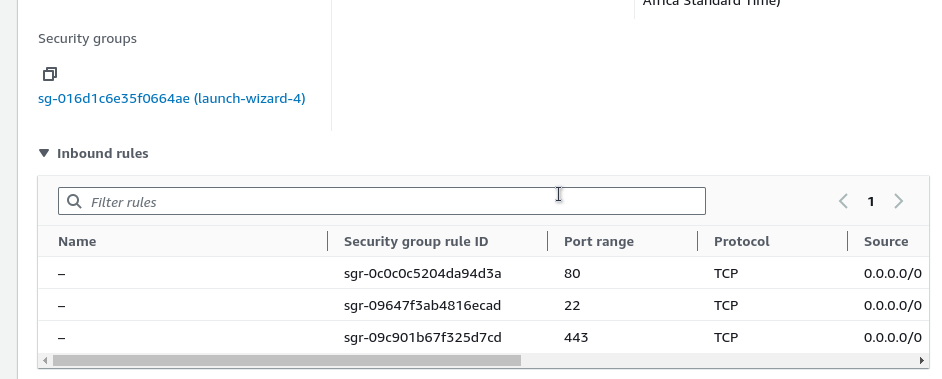

<!-- @format -->

# SETTING UP MERN STACK

In this module we are going to configure our server to setup **MERN** stack for
us **MERN STACK** stands for **_Mongodb, Express, React and Nodejs_** this stack
is famous among web developers its a javascript webstack that allows us run
javascript both on the client-side and server-side of our application. While
mongodb is a document database management system it allows for the flexibility
and scalabity of queries. MongoDB is part of the No-SQL family which stands for
**_Not only SQL_** it stores data in a JSON-format and allow for querying and
indexing of data easy and flexible. we are going to setup this stack first by
getting our server up and running.

## STEP 1

Before starting we are going to need our server up and running and for us to do
that we are going too need to setup an instance on aws.

1. ### An EC2 instance of t2.micro running Ubuntu Server 24.04 LTS (HVM) SSD Volume Type has been setup called nginix server


2. ### After we that we create our ssh key this keys gives us access to our login into our instance


this key need to be protected and only the owner need too have access to the key

3. ### After that we configure our network security group settings by default ssh port is being set in the instance this allows us too easily ssh into our server

   - then we can set our server to listen on port 443 to allow https traffic
   - secondly we allow our server to listen port 80 to allow http traffic

   

   ### then we also config the storage to be 30GB

   

after going through all this step we click on launch instance this then lauch
our instance making our server readily available for us. This conclude our step
on launching a server.

## CONFIGURING BACKEND

now that we have our server up and running it's time for us too setup nodejs.
Nodejs allows javascript to run on the serverside of our application.

before install nodejs first we need to get the location of nodejs software on
ubuntu. by running the following command

```bash
$ sudo apt update && sudo apt -y upgrade
```

 

the above command ensure that our ubuntu command is updated and also upgrade any
dependencies running on our server. now we can run this command to get the
nodejs repository to our server

```bash
curl -fsSL https://deb.nodesource.com/setup_18.x | sudo -E bash -
```


as we can see from the image above we have succefully configured the nodejs
repository on our server now we can install nodejs on our backend by running the
followin comamand


now that we have node js installed we can verify if the installation is
successful by running the following command

```bash
node -v
```

we get to see something like this that displays the version of our nodejs


we can also verify its package manager is installed by running the following
command

```bash
npm -v
```


now that we have node setup and running on our server we can now starting
setting up our application we can do that by first creating a directory

```bash
mkdir todo
```

the command above will create the directory in our server we can use the ls
command to see if our directory was successfully created

```bash
ls
```


and we can use the cd command to step intoo our directory

```bash
cd todo
```


and we can use the pwd to see our current working directory which should be todo
at this point.

```bash
pwd
```


we can see from the image above we are currently in the todo directory

## INSTALL EXPRESS JS

Now that we have node up and running we are going to need too install Expressjs
which is a nodejs framework that has handle some abstractions for us that we
don't have too worry about for example routing express js server already handles
routing for us without having to do so ourselves. Too get started we are going
to use the node package manage **(npm)** to install express js.

```bash
npm install express
```


```bash
npm install dotenv
```


now that we have successfully import both packages we can now begin to write our
first javascript code. We are going to attempt to create a simple todo app.
First we create an index.js file using the touch command or we can use the vim
command to directly create and start writing into our file.

```bash
touch index.js && vim index.js
```

after that we write the following line of code

```js
const express = require("express");
require("dotenv").config();

const app = express();
const port = process.env.PORT || 5000;

app.use((req, res, next) => {
  res.header("Access-Control-Allow-Origin", "*");
  res.header(
    "Access-Control-Allow-Headers",
    "Origin, X-Requested-With, Content-Type, Accept"
  );
  next();
});

app.use((req, res, next) => {
  res.send("Welcome to Express");
});

app.listen(port, () => {
  console.log(`Server running on port ${port}`);
});
```

we can see that from the written code above we allow our port to listen on
port 5000. and then we can run our start our application by running the
following command.

```bash
node index.js
```

if our application is running succesffuly we should see the following from the
image below


we can either curl intoo our server or run it from the browser. too use curl run
the following command

```bash
curl http://localhost:5000
```


too run our server on the  browsser first we need too allow our server too listen on port 5000and to do that we need to go to AWS EC2 instance dashboard and then navigate to
our security group 




we click on the edit action inbound rules this will navigate us too a page that
allows us too edit our inbound rules


we click on the add rules button this allows to add custom rules too our
security group, we set a custom TCP port that listen on port 5000 this allows
our server too run on port 5000 we save the rule.


now we can run our server on port 5000 and get back our response.


now we will continue building on our todo app three action are to be performed
on our todo app

1. Create a new task
2. Display list of all tasks
3. Delete a completed task

we need to make each task associated with some particular endpoint and will use
different standard HTTP request methods POST, GET, DELETE. Each task need a
routes that can be use to define various endpoints that the to-do app will
depend on. We are first going to start by creating a routes directory

```bash
mkdir routes
```

then we cd into the routes directory

```bash
cd routes
```

then we create a file using

```bash
vim api.js
```

then we write the following js code into the file this code allows us too define
different endpoint for our todo app.

```js
const express = require('express');
const router = express.Router();

router.get('/todos', res, next) => {

});

router.post('/todos', res, next) => {

});

router.delete('/todos/:id', (req, res, next) => {

});

module.exports = router;
```


next we create javascript models

## Models

We are going to start of by install a mongodb javascript driver called mongoose.
Mongoose is an ODM (Object Data Modeling) library for MongoDB and Node.js. It allows defining models using schemas and provides methods to interact with MongoDB.

But before we do that we are going to unerstand what models. In JavaScript, models are abstractions used to represent and manage data within applications. They encapsulate the logic related to data retrieval, manipulation, and storage, and are often a key component in frameworks and libraries that follow the Model-View-Controller (MVC) or similar architectural patterns.

### Key Concepts of Models in JavaScript
1. Definition and Purpose
   - Definition: A model is a construct that represents the data and the business logic of an application. It defines the structure of data and the operations that can be performed on it.
   - Purpose: Models are used to manage the data of an application, ensuring data integrity, validation, and business logic encapsulation.
2. Structure of a Model
   - Attributes: These are the properties or fields that define the structure of the data. For example, in a user model, attributes might include name, email, and password.
   - Methods: These are functions that define operations on the data. Methods can include data validation, saving data to a database, or computing derived values.

that is a brief explanation on models in javascript now let's start of by installing mongoose by running the following command. ensure we are currently in th the todo directory


```bash
npm install mongoose
```


after installing mongoose we need to create a models directory that will store our model file inside of the model directory we then create a todo.js file we can do that by running the following command
```bash
mkdir models && cd models && vim todo.js
```

inside of our created todo js file we can now define our schema by writing the following JS code
```js
const mongoose = require('mongoose');
const Schema = mongoose.Schema;

const TodoSchema = new Schema({
        action: {
                type: String,
                required: [true, 'The todo text fields is required']
        }

});

const Todo = mongoose.model('todo', TodoSchema);

module.exports = Todo;

```


Now we need to modify our routes from the api.js file in the routes directory to make use of the newly define model.

In the route directory we open api.js with vim api.js we then delete all the code inside with ***:%d*** will wipe all our inputed code in the file we can then define the routes all over again with  the following JS code.

```js
const express = require('express');
const router = express.Router();
const Todo = require('../models/todo');

router.get('/todos', (req, res, next) => {
        Todo.find({}, 'action')
                .then(data => res.json(data))
                .catch(next)
});

router.post('/todos', (req, res, next) => {
        if (req.body.action) {
                Todo.create(req.body)
                .then(data => res.json(data))
                .catch(next)
        }else {
                res.json({
                        error: "The input field is empty"
                })
        }
});

router.delete('/todos/:id', (req, res, next) => {
        Todo.findOneAndDelete({"_id": req.params.id})
        .then(data => res.json(data))
        .catch(next)
})

module.exports = router;
```


## MongoDB Database

now we  need to setup our __mongo__ DB database on the cloud using [MLab](https://www.mongodb.com/products/try-free/platform/atlas-signup-from-mlab) after creating account by providing our necessary detail we need to setup our mongo db. first thing first we opt for the 512mb free tier provided to us.


and then we selected aws as our host provider and then fill up other optional information chose the location nearby to us.


now we get redirected to our mlab dashboard just down below we get too see the get connection string icon.

first we need to visit the network security tab and set our IP address to be open to all IP


we click on the edit tab to allow all IP to accesss our DB


we click on its and then we get a pop to create a database user


we set the username and password in the provided field then we choose the connection method we wants 


we select Nodejs as our driver and then select the stable version type next we copy our connection string provided to us.


after that we create a .env file inside of our todo directory to paste our connection string this allow nodejs to read the .env file and get the database environment variable


we replace the \<password> with our provided password while connecting adding the connection string to our .env file. 

Now we need to rewrite our index.js to connect to our mongodb using mongoose we will overwrite our index.js file with the following code to clear our index.js we can run the follwing command in vim ***:%d***

```js
const express = require('express');
const bodyParser = require('body-parser');
const mongoose = require('mongoose');
const routes = require('./routes/api');
const path = require('path');
require('dotenv').config();

const app = express();
const port = process.env.PORT || 5000;

// Connect to the database
mongoose.connect(process.env.DB, { useNewUrlParser: true, useUnifiedTopology: true })
  .then(() => console.log('Database connected successfully'))
  .catch(err => console.log(err));

// Since mongoose promise is deprecated, override it with Node's promise
mongoose.Promise = global.Promise;

// Middleware for CORS
app.use((req, res, next) => {
  res.header("Access-Control-Allow-Origin", "*");
  res.header("Access-Control-Allow-Headers", "Origin, X-Requested-With, Content-Type, Accept");
  res.header("Access-Control-Allow-Methods", "GET, POST, PUT, DELETE, OPTIONS");
  if (req.method === "OPTIONS") {
    return res.status(200).end();
  }
  next();
});

// Middleware for parsing JSON bodies
app.use(bodyParser.json());

// Define routes
app.use('/api', routes);


// Root route for debuging purpose
app.get('/', (req, res) => {
  res.send('Hello World');
});

// Handle 404 errors for debugging purpose
app.use((req, res, next) => {
  res.status(404).send("Sorry can't find that!");
});

// Error handling middleware for debuggin purpose
app.use((err, req, res, next) => {
  console.error(err.stack);
  res.status(500).send('Something broke!');
});

// Start the server
app.listen(port, () => {
  console.log(`Server is running on port ${port}`);
});

```
<!--  -->

here we can see our connection to the database was successful we can ignore the


now we can use our postman to mock our client since we do not have any client UI postman can be use too mock our client too get postman and get it running we can visit [postman](https://www.postman.com/downloads/)

now we need to send a request to our server but before doing that we need tto set  the ***Content-Type*** to application/json by clicking on the headers tab.


now we can send a Post request to our server by doing the following in the image below


now that we send a request to our server we get back a response of our inputed data including an auto-generated _id and a v field, this were auto generated from the backend of our application. we can also send a Get request to the same server by doing the following a Get request does not contain a body in its reponse so we do the following


now we get  back a response of our requested data from the server. we can also perform a delete request by parsing in our id each id response returned from the database are unique to particular instance in the database this we can pass that uniquely identifiable field to our delete method for the database to easily search and process our request.


we get a response of our deleted resource from the server we can now confirm our resource has been deleted by running the get method to try too get all resource from our server.


we can see that no resource is being returned this is because we've deleted our only resources added to the database.


## Frontend creation

We are going to begin to build the client-side of our application one where the user can now gets to intereact withour application. we will start off by running the following the command

```bash
npx create-react-app client
```


before testing our react app there are some dependencies we need to run to get make it ease for use while running our application.

first we need to install ***concurrently*** which allows us to run multiple command like it name says concurrently, we can install it by running the following command.

```bash
npm install concurrently --save-dev
```


we also need to install ***nodemon***, this allows our server to auto-reload anytime a change has been made to a js file in the backend code we can install it by running the following command

```bash
npm install nodemon --save-dev
```


now we need to configure our package.json by entering the  following line of code in our package.json file or

```json
  "scripts": {
         "start": "node index.js",
         "start-watch": "nodemon index.js",
         "dev": "concurrently \"npm run start-watch\" \"cd client && npm start\""
  }
```


and also we need to modify our client package.json by adding the following line of code

```json
"proxy": "http://localhost:5000"
```


we can now run ```npm run dev``` and get the following output


now our app can now open and run on port 3000 or we can configure our server to allow port 3000 if its not configured in our server security group.


## Creating your react components

we are going to start off by writing some react code alot of react code but it'll be fun let's start bby navigating to our client directory by running the chain of command below.

```bash
cd client && cd src && mkdir components; cd components
```

inside of our componet directory we will first create an ***Input.js*** file and inside we'll write the following code

```js
import React, { Component } from 'react';
import axios from 'axios';

class Input extends Component {
  constructor(props) {
    super(props);
    this.state = {
      action: ""
    };
    this.addTodo = this.addTodo.bind(this);
    this.handleChange = this.handleChange.bind(this);
  }

  addTodo() {
    const task = { action: this.state.action };

    if (task.action && task.action.length > 0) {
      axios.post('/api/todos', task)
        .then(res => {
          if (res.data) {
            this.props.getTodos();
            this.setState({ action: "" });
          }
        }).catch(err => console.log(err));
    } else {
      console.log('Input field required');
    }
  }
 handleChange(e) {
    this.setState({
      action: e.target.value
    });
  }

  render() {
    let { action } = this.state;
    return (
      <div>
        <input type="text" onChange={this.handleChange} value={action} />
        <button onClick={this.addTodo}>Add Todo</button>
      </div>
    );
  }
}

export default Input;
```

after that we save our file and quit from its by running :wq command

we create open another file in vim called ***ListTodo.js*** inside of the file we write the following code

```js
import React from 'react';

const ListTodo = ({ todos, deleteTodo }) => {
  return (
    <ul>
      {todos && todos.length > 0 ? (
        todos.map((todo) => {
          return (
            <li key={todo._id} onClick={() => deleteTodo(todo._id)}>
              {todo.action}
            </li>
          );
        })
      ) : (
        <li>No todo(s) left</li>
      )}
    </ul>
  );
};

export default ListTodo;

```

we save and quit from the file again then wwe create another file called ***Todo.js*** and we input the following code into the file.

```js
import React, { Component } from 'react';
import axios from 'axios';

import Input from './Input';
import ListTodo from './ListTodo';

class Todo extends Component {
    state = {
        todos: []
    }

    componentDidMount(){
        this.getTodos();
    }

    getTodos = () => {
        axios.get('api/todos')
        .then(res => {
            if (res.data) {
               this.setState({
                   todos: res.data
            })
         }
        }).catch(err => console.log(err))
    }
    deleteTodo = (id) => {
        axios.delete(`api/todos/${id}`)
        .then(res => {
            if (res.data) {
                this.getTodos()
               }
            }).catch( err => console.log(err))
    }

    render () {
        let { todos } = this.state;
        return (
           <div>
              <h1> My Todo(s)</h1>
              <Input getTodo={this.getTodos} />
              <ListTodo todos={todos} deleteTodo={this.deleteTodo} />
           </div>
        )
     }
}

export default Todo;
```

we save save and quit from our vim editor now that we have successfully written our react code we can then navigate to the ***src***  folder by running the following command

```bash
cd ..
```

we open the App.js and replace the following lines of code with the following
```js
import logo from './logo.svg';
import Todo from './components/Todo';
import './App.css';


const App = () => {
    return (
       <div className="App">
       <Todo />
       </div>
    );
}

export default App;
```

we save and quit from the file then we open the App.css file and replace the lines of code with the following.

```css
.App {
 text-align: center;
 font-size: calc(10px + 2vmin);
 width: 60%;
 margin-left: auto;
 margin-right: auto;
}

input {
height: 50px;
width: 50%;
border: none;
border-bottom: 2px #101113 solid;
background: none;
font-size: 1.5rem;
color: #787a80;
}

input:focus {
    outline: none;
}

button {
width: 25%;
height: 45px;
border: none;
margin-left: 10px;
font-size: 25px;
background: #101113;
border-radius: 5px;
color: #787a80;
cursor: pointer;
}

button:focus {
    outline: none;
}

ul {
    list-style: none;
    text-align: left;
    padding: 15px;
    background: #171a1f;
    border-radius: 5px;
}

li {
    padding: 15px;
    font-size: 1.5rem;
    margin-bottom: 15px;
    background: #282c34;
    border-radius: 5px;
    overflow-wrap: break-word;
    cursor: pointer;
}

@media only screen and (min-width: 300px) {
    .App {
        width: 80%;
    }
    input {
        width: 100%;
    }

    button {
        width: 100%;
        margin-top: 15px;
        margin-left: 0;
    }
}

@media only screen and (min-width: 640px) {
    .App {
        width: 60%;
     }
     input {
         width: 50%;
     }

     button {
         width: 30%;
         margin-left: 10px;
         margin-top: 0;
     }
}

```

we save once again and quit from the vim editor we open our index.css file and replace the following lines fo code with the one below

```css
body {
  margin: 0;
  padding: 0;
  font-family: -apple-system, BlinkMacSystemFont, 'Segoe UI', 'Roboto', 'Oxygen',
    'Ubuntu', 'Cantarell', 'Fira Sans', 'Droid Sans', 'Helvetica Neue',
    sans-serif;
  -webkit-font-smoothing: antialiased;
  -moz-osx-font-smoothing: grayscale;
  box-sizing: border-box;
  background-color: #282c34;
  color: #787a80;
}

code {
  font-family: source-code-pro, Menlo, Monaco, Consolas, 'Courier New',
    monospace;
}
```
now that we've successfully inputed the code we can run and build our application. first we need to navigate to our project top directory which is the todo/ folder to do that we can run the following command.

``` bash
cd ../..
```
now we can run our server by running the following command.

```bash
npm run dev
```


the diagram below shows our server buiild successfully


we can open our application on our browser to see the homepage


##### we have come to the end of setting up MERN stack which we were able to acheive succefully special thanks to [steghub](https://steghub.com/)