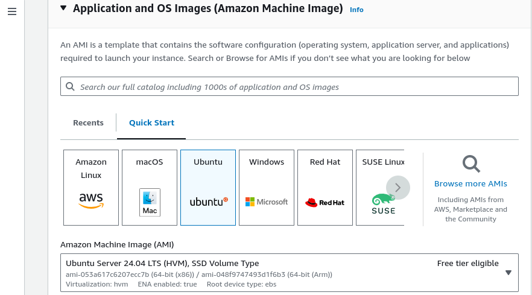
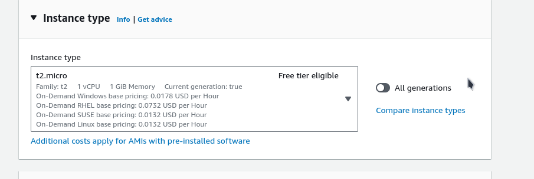
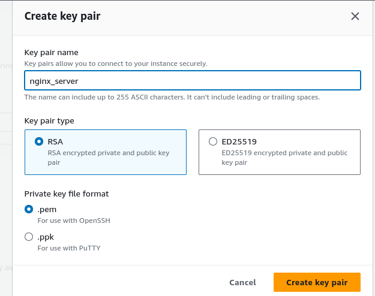
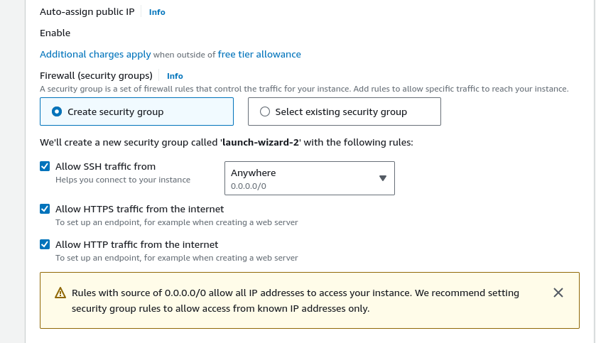
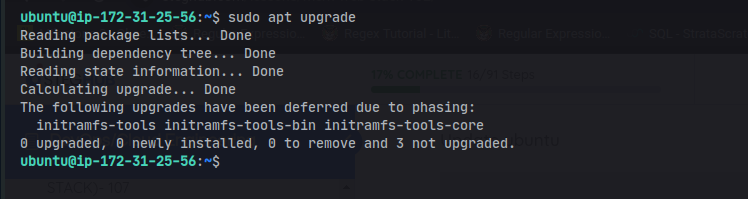
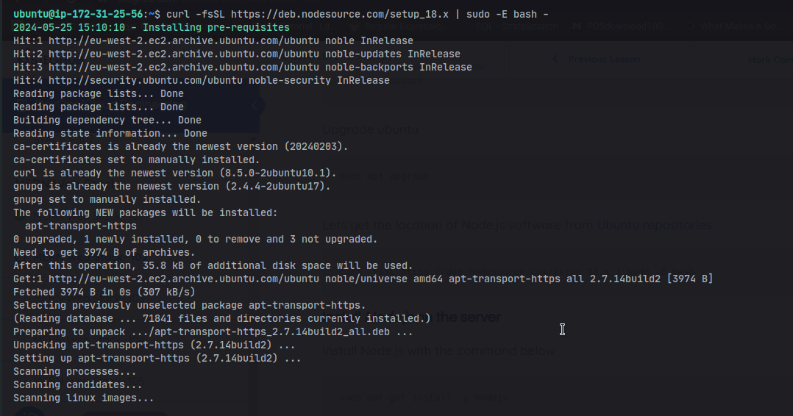
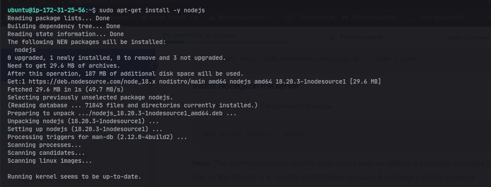
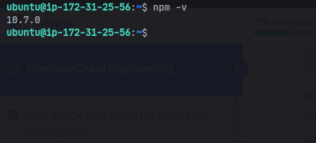
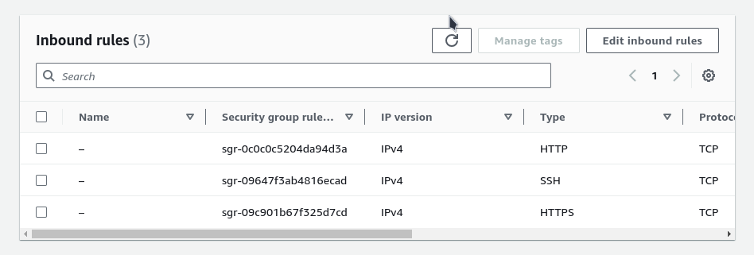

<!-- @format -->

# SETTING UP MEAN STACK

In this module we are going to configure our server to setup **MEAN** stack for
us **MEAN STACK** stands for **_Mongodb, Express, Angular and Nodejs_** this
stack is famous among web developers its a javascript webstack that allows us
run javascript both on the client-side and server-side of our application. While
mongodb is a document database management system it allows for the flexibility
and scalabity of queries. MongoDB is part of the No-SQL family which stands for
**_Not only SQL_** it stores data in a JSON-format and allow for querying and
indexing of data easy and flexible. we are going to setup this stack first by
getting our server up and running.

## STEP 1

Before starting we are going to need our server up and running and for us to do
that we are going too need to setup an instance on aws.

1. ### An EC2 instance of t2.micro running Ubuntu Server 24.04 LTS (HVM) SSD Volume Type has been setup called nginix server




2. ### After we that we create our ssh key this keys gives us access to our login into our instance



this key need to be protected and only the owner need too have access to the key

3. ### After that we configure our network security group settings by default ssh port is being set in the instance this allows us too easily ssh into our server

   - then we can set our server to listen on port 443 to allow https traffic
   - secondly we allow our server to listen port 80 to allow http traffic

   

   ### then we also config the storage to be 30GB

   

after going through all this step we click on launch instance this then lauch
our instance making our server readily available for us. This conclude our step
on launching a server.

## CONFIGURING BACKEND

now that we have our server up and running it's time for us too setup nodejs.
Nodejs allows javascript to run on the serverside of our application.

before install nodejs first we need to get the location of nodejs software on
ubuntu. by running the following command

```bash
$ sudo apt update && sudo apt -y upgrade
```




the above command ensure that our ubuntu command is updated and also upgrade any
dependencies running on our server. now we can run this command to get the
nodejs repository to our server

```bash
sudo apt -y install curl dirmngr apt-transport-https lsb-release ca-certificates

curl -fsSL https://deb.nodesource.com/setup_18.x | sudo -E bash -
```





as we can see from the image above we have succefully configured the nodejs
repository on our server now we can install nodejs on our backend by running the
following comamand

```bash
sudo apt-get install nodejs -y
```



now that we have node js installed we can verify if the installation is
successful by running the following command

```bash
node -v
```

we get to see something like this that displays the version of our nodejs


we can also verify its package manager is installed by running the following
command

```bash
npm -v
```



now that we have node setup and running on our server we can now starting
setting up our application we can do that by first creating a directory

## Install MongoDB

Now that **Nodejs** has been installed on the server we can now add our Data
Base which in this case will be MongoDB a document based database for storing
data flexibly in a json format. We can start off by installing following the
neccessary step.

1. first we import the GPG key

```bash
    curl -fsSL https://www.mongodb.org/static/pgp/server-7.0.asc | \
    sudo gpg -o /usr/share/keyrings/mongodb-server-7.0.gpg \ --dearmor
```

2. now we can add MongoDB to our source.list.d so our APT command can find the
   mongodb source file. and we can acheive this by running the following command

```bash
    echo "deb [ arch=amd64,arm64 signed-by=/usr/share/keyrings/mongodb-server-7.0.gpg ] https://repo.mongodb.org/apt/ubuntu jammy/mongodb-org/7.0 multiverse" | sudo tee /etc/apt/sources.list.d/mongodb-org-7.0.list
```

3. now we can install MongoDB by running the following command

```bash
    sudo apt-get install -y mongodb-org
```


and now we have mongodb installed on our system all that remain for us too start
using is too get it up and running and too do so we need too run the forllowing
command

```bash
sudo service mongod start
```

to get our mongodb server started too see the our mongodb status we can run the
following command to see if its truly enabled

```bash
sudo service mongod status
```


we need body parser. It helps us process json files passed in requests to the
server. We can do so by running the following command

```bash
sudo npm install body-parser
```


## Build application

we can start building our application which in this case will be a simple CRUD
book application we can start by creating the project directory by running the
following command

```bash
mkdir books; cd books
```

inside of our book application we can run the following command to initialise
our node server

```bash
npm init
```

we can install express js by running the following command

```bash
npm install express -g
```

inside of our project directory we'll create a file called server.js by using
vim

```bash
vim server.js
```

inside of our file we will write the following code

```js
var express = require('express');
var bodyParser = require('body-parser');
var app = express();

app.use(express.static__dirname + '/public'));
app.use(bodyParser.json());
require('./apps/routes')(app);
app.set('port', 3300);
app.listen(app.get('port'), function() {
	console.log('Server up: http://localhost:' + app.get('port'));
});
```

## install mongoose

now we need to install mongoose a MongoDB driver for expressjs it allows us too interact with mongodb using Javascript. we can install by writing the following code in our terminal

```bash
sudo npm install mongoose
```


inside of our book directory we need to create a sub-directory called app by writing the following command.

```bash
mkdir app; cd app
```
inside of our app directory we create a route.js file and in there we define our project endpoints by writing the following code

```js
var Book = require('./models/book');

module.exports = function(app) {
    // Get all books
    app.get('/book', function(req, res) {
        Book.find({}, function(err, result) {
            if (err) throw err;
            res.json(result);
        });
    });

    // Add a new book
    app.post('/book', function(req, res) {
        var book = new Book({
            name: req.body.name,
            isbn: req.body.isbn,
            author: req.body.author,
            pages: req.body.pages
        });
        book.save(function(err, result) {
            if (err) throw err;
            res.json({
                message: "Successfully added book",
                book: result
            });
        });
    });

    // Delete a book by ISBN
    app.delete('/book/:isbn', function(req, res) {
        Book.findOneAndRemove({ isbn: req.params.isbn }, function(err, result) {
            if (err) throw err;
            res.json({
                message: "Successfully deleted the book",
                book: result
            });
        });
    });

    // Serve the index.html file for all other routes
    var path = require('path');
    app.get('*', function(req, res) {
        res.sendFile(path.join(__dirname, 'public', 'index.html'));
    });
};
```

inside of our app directory we create another sub-drectory model this is where the project model will be stored. we can do so by running the following command

```bash
mkdir model; cd model
```
we create and write to the following book.js file using vim

```bash
vim book.js
```

```js
var mongoose = require('mongoose');

// MongoDB connection string
var dbHost = 'mongodb://localhost:27017/test';
mongoose.connect(dbHost, { useNewUrlParser: true, useUnifiedTopology: true });

// Enable mongoose debugging
mongoose.set('debug', true);

// Define the book schema
var bookSchema = new mongoose.Schema({
    name: String,
    isbn: { type: String, index: true },
    author: String,
    pages: Number
});

// Create the Book model from the schema
var Book = mongoose.model('Book', bookSchema);

// Export the Book model
module.exports = Book;
```

we can now go to our root project directory from where we are by running the following command
```bash
cd ../../
```
all that's left is too see if we have fully configured our server propery by running the following command

```bash
node server.js
```
if our server is successfully configured we should see the following output


we also need to configure our server too listen on port 3300 by going to our aws **EC2** instance dashboard 




we click on the edit action inbound rules this will navigate us too a page that
allows us too edit our inbound rules


we click on the add rules button this allows to add custom rules too our
security group, we set a custom TCP port that listen on port 3300 this allows
our server too run on port 3300 we save the rule.


we click on the save button. Configuring our server to listen on port 3300 means it can accept requests on this port. However, to allow external traffic to reach the server on this port, you must also ensure that the security group associated with the server permits inbound traffic on port 3300.


## Access route with angular JS.

We are now going to design our client side of the application this is the part that get visible for the user to interact with our application. from our root project directory we create a new sub-directory called public by running the following comannd.

```bash
mkdir public; cd public
```

inside of the public directory we create a new file and write to its using vim
```bash
vim script.js
```

and inside of the file we write the follwing code.

```js
var app = angular.module('myApp', []);

app.controller('myCtrl', function($scope, $http) {
    // Fetch all books
    $http({
        method: 'GET',
        url: '/book'
    }).then(function successCallback(response) {
        $scope.books = response.data;
    }, function errorCallback(response) {
        console.log('Error: ' + response);
    });

    // Delete a book
    $scope.del_book = function(book) {
        $http({
            method: 'DELETE',
            url: '/book/' + book.isbn
        }).then(function successCallback(response) {
            console.log(response);
        }, function errorCallback(response) {
            console.log('Error: ' + response);
        });
    };

    // Add a new book
    $scope.add_book = function() {
        var body = {
            name: $scope.Name,
            isbn: $scope.Isbn,
            author: $scope.Author,
            pages: $scope.Pages
        };

        $http({
            method: 'POST',
            url: '/book',
            data: body
        }).then(function successCallback(response) {
            console.log(response);
        }, function errorCallback(response) {
            console.log('Error: ' + response);
        });
    };
});
```

we save and close the file after that we create a new file called index.html using vim then we write the following content inside the file.

```html
<!doctype html>
<html ng-app="myApp" ng-controller="myCtrl">
<head>
    <script src="https://ajax.googleapis.com/ajax/libs/angularjs/1.6.4/angular.min.js"></script>
    <script src="script.js"></script>
</head>
<body>
    <div>
        <table>
            <tr>
                <td>Name:</td>
                <td><input type="text" ng-model="Name"></td>
            </tr>
            <tr>
                <td>Isbn:</td>
                <td><input type="text" ng-model="Isbn"></td>
            </tr>
            <tr>
                <td>Author:</td>
                <td><input type="text" ng-model="Author"></td>
            </tr>
            <tr>
                <td>Pages:</td>
                <td><input type="number" ng-model="Pages"></td>
            </tr>
        </table>
        <button ng-click="add_book()">Add</button>
    </div>
    <hr>
    <div>
        <table>
            <tr>
                <th>Name</th>
                <th>Isbn</th>
                <th>Author</th>
                <th>Pages</th>
            </tr>
            <tr ng-repeat="book in books">
                <td>{{book.name}}</td>
                <td>{{book.isbn}}</td>
                <td>{{book.author}}</td>
                <td>{{book.pages}}</td>
                <td><input type="button" value="Delete" ng-click="del_book(book)"></td>
            </tr>
        </table>
    </div>
</body>
</html>
```

now our applcation is up and running we can view on our browser by using our ***http://ipadress:port***


