# MYSQL CLIENT SERVER ARCHITECTURE

In this project module we are going to setup a *****MYSQL***** client server architecture also known as the.

Client-server architecture is a common model for organizing and managing distributed applications where the workload is divided between providers of a resource or service, called servers, and service requesters, called clients. MySQL, as a relational database management system (RDBMS), fits well within this architecture.

### Components of the Architecture:

#### 1. Client: This is any device or application that requests data or services from the server. Clients can be web browsers, desktop applications, mobile apps, or other servers.
#### 2. Server: This is a central system that provides data or services to clients. In this context, the MySQL server manages the database and handles queries from clients.

### Workflow:
- Client Request: The client sends a request to the MySQL server. This could be a query to retrieve data, insert new data, update existing data, or delete data.
- Server Processing: The MySQL server processes the client's request. It executes the SQL queries, interacts with the database, and performs necessary computations.
- Response: After processing the request, the MySQL server sends a response back to the client. This response contains the requested data or a confirmation of the performed operation.

### Advantages of Client-Server Architecture with MySQL
- Scalability: The architecture allows for multiple clients to connect to the MySQL server simultaneously. The server can handle many requests concurrently.
- Centralized Management: All the data is managed in one central location (the MySQL server), making it easier to manage and maintain.
- Security: The server can implement robust security measures to protect the data and manage access controls.
- Data Integrity: MySQL provides mechanisms for ensuring data integrity, including transactions and constraints.

### Disadvantages of Client-Server Architecture with MySQL


MySQL server architecture, like any other database management system architecture, comes with its own set of disadvantages. Here are some of the key drawbacks:

### 1. Single Point of Failure
- Issue: In a basic single-server setup or even a master-slave setup, if the master server goes down, the entire database service can be disrupted until failover mechanisms take place.
- Mitigation: Implementing high availability solutions, such as master-master replication, clustering, or using managed services that offer built-in failover mechanisms.
#### 2. Scalability Limitations
- Issue: While MySQL can scale vertically (by upgrading the hardware of the server), it faces challenges with horizontal scaling, especially with write operations. Replication can help with read scaling, but writes are still bottlenecked by the master server.
- Mitigation: Implement sharding to distribute data across multiple servers, though this adds complexity in terms of data partitioning and management.
### 3. Replication Lag
- Issue: In master-slave replication, there can be a lag between when data is written to the master and when it is replicated to the slave servers. This can lead to inconsistent reads if the application depends on immediate consistency.
- Mitigation: Using semi-synchronous replication can reduce lag, but it may impact write performance. Architecting the application to handle eventual consistency can also help.


now that we fully understand what ***mysql client-server*** architecture means we can now dive deep into setting up a client-server architecture with mysql

### Server setup

For this project we are going to be using two distinct AWS server. one for our client while the other for our server. this will be a simple or basic client-server architecture.

1. ### An EC2 instance of t2.micro running Ubuntu Server 24.04 LTS (HVM) SSD Volume Type has been setup called mysql server

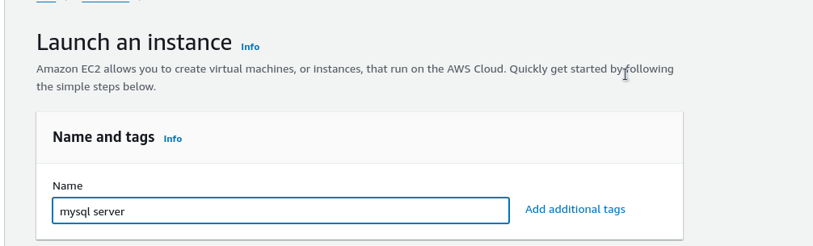

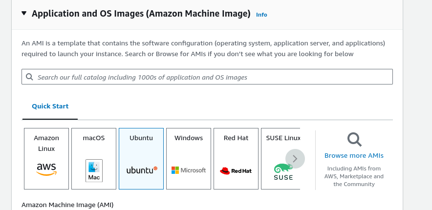

2. ### After we that we create our ssh key this keys gives us access to our login into our instance

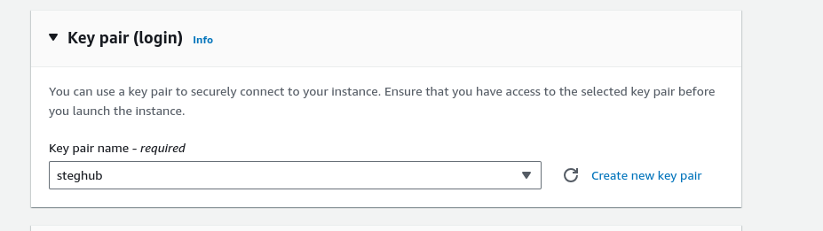

this key need to be protected and only the owner need too have access to the key

3. ### After that we configure our network security group settings by default ssh port is being set in the instance this allows us too easily ssh into our server

   - then we can set our server to listen on port 443 to allow https traffic
   - secondly we allow our server to listen port 80 to allow http traffic

   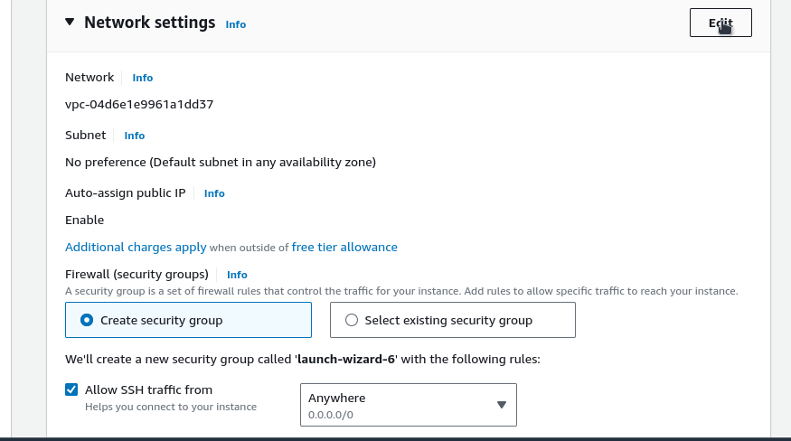
   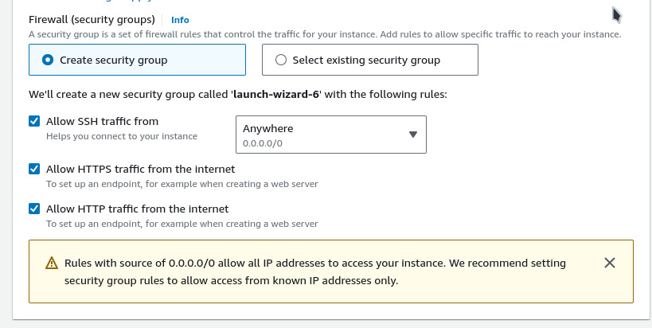


after going through all this step we click on launch instance. Now we need too setup another server by going through the above step again and this time we name the server **mysql client**

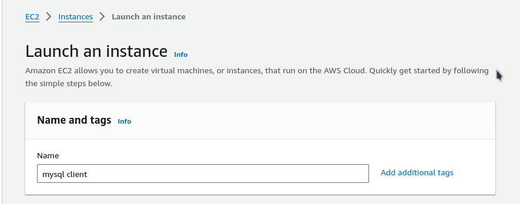


## Install MySQL Server

Now we are going to install mysql server on our linux ___sql server___ instance 
by running the following command below

```bash
sudo apt-get update && sudo apt-get install -y mysql-server
```

and then if you'd wants too you can run this command too improve mysql security installation

```bash
sudo mysql_secure_installation utility
```

we can check our mysql server status too ensure that it is currently running
```bash
sudo server mysql status
```
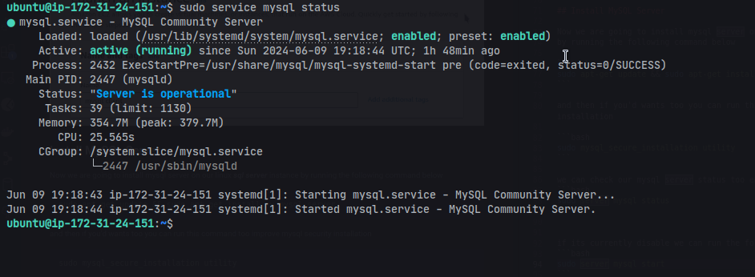

if its currently disable we can run the following command to enable the server
```bash
sudo service mysql start
```

## Install MySQL Client
our next step is too install mysql client on the linux ***mysql client server***  by running the following command

```bash
sudo apt-get update && sudo apt-get install -y mysql-client
```
in our MySQL linux server  we are going to configure our server to listen on port **3306** and to do this we are going to navigate to our aws instance click on the mysql linux server and then navigate to edit inbound rules to open port 3306

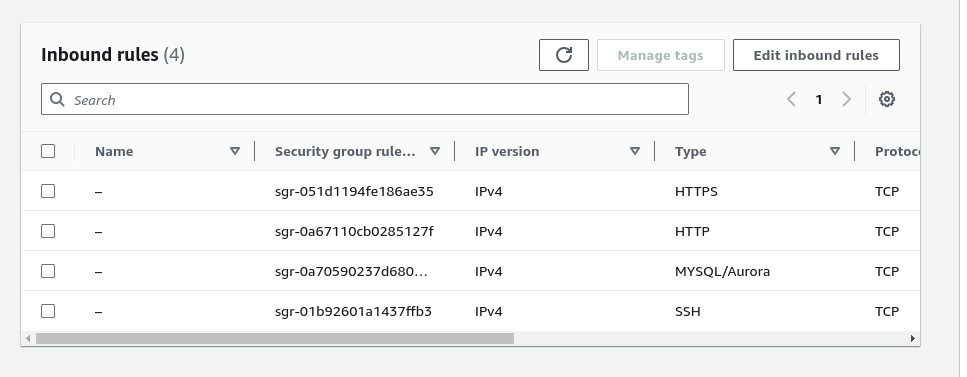

we click on the edit inbound rules and then we get taken to this page where we get to edit our inbound rules

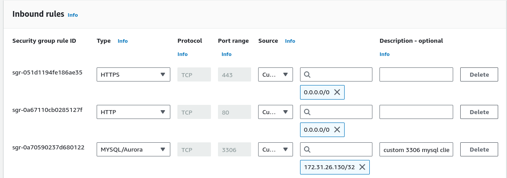

but this time we add our server private IP address only and not all addresses this is for security reasons. we save the inbound rule and then navigate to our mysql server instance. too allow allow connections from remote hosts. first we navigate to mysql.cnf configuration file using vim

```bash
sudo vim /etc/mysql/mysql.conf.d/mysqld.cnf
```

inside of the file we locate the bind-address variable and replace it from the localhost IP address and open its to all IP address by writing the following code

```sql
bind-address = 0.0.0.0
```

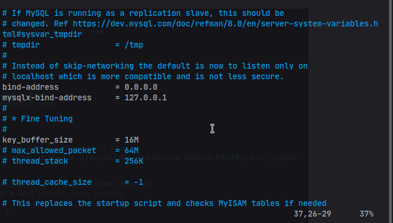

we save thee file and then we restart our mysql server by running the following command

```bash
sudo systemctl restart mysql
```

this will reload our mysql server for us we can now login our mysql terminal too create a dummy database database

by running the following command

```sql
CREATE DATABASE simi_db;
```
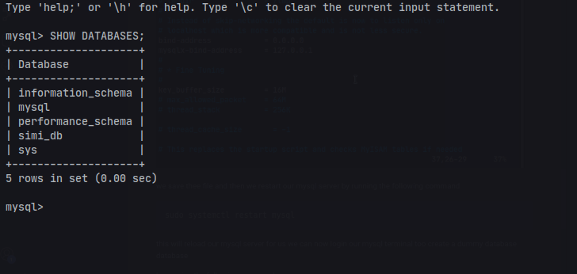

then we can create a new user by running the following command
and then we grant the user all privileges on the newly created database

```sql
CREATE USER 'simi'@'<your-sql-client-server-private-ip>' IDENTIFIED BY '<your-password>'
```

and then we grant the user all privilege on the database

```sql
GRANT ALL PRIVILEGES ON databasename.* TO 'username'@'localhost';
```

at this point we can now go to our client server and try access our sql server from there

by running the following code

```bash
mysql -u <user> -p -h <your-sql-server-public-ip-address>
```
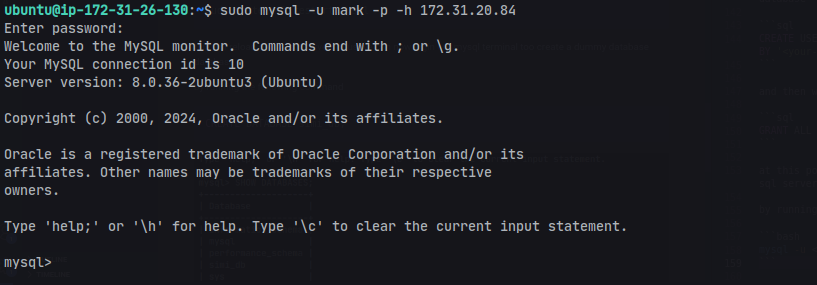

now we can truly see if we can see our created database on the server

by running the following sql command
```sql
SHOW DATABASES;
```
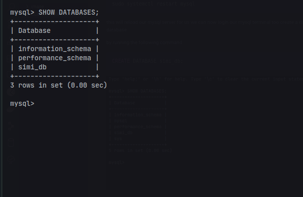.

##### we have come to the end of setting up MYSQL client-server architecture which we were able to acheive succefully special thanks to [steghub](https://steghub.com/)                                                                                                                                                          

