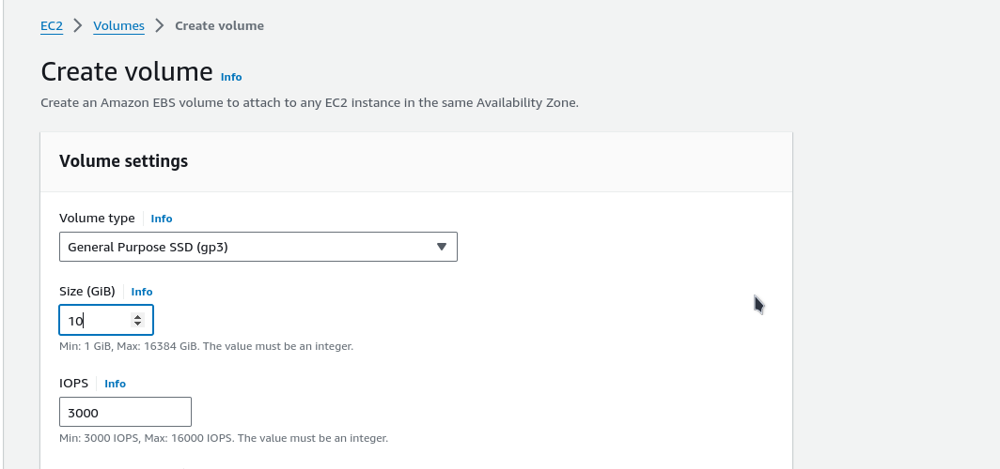
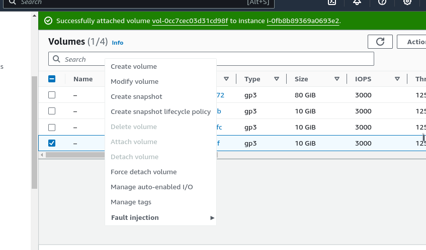

# Web Solution With Word Press

In this module I am going to demonstrate my understanding on implementing  web solution with word press. I am going to prepare a storage infrastructure on two linuz servers and implement a basic websolution using **WordPress**, which is a free open-source content management system built on PHP and paired with **MySQL** Database Management System.


## This project consist of two parts

1. Configure storage subsystem for Web and Database servers based on Linux OS.
2. Install WordPress and connect it to a remote MySQL database server.

## Three-tier Architecture

A three-tier layer application is an architectural pattern used in software development to organize applications into three separate layers: the presentation layer, the application logic layer (or business logic layer), and the data layer. This separation of concerns helps in managing, maintaining, and scaling the application efficiently. Here’s an explanation of each layer:

### 1. Presentation Layer
The presentation layer is the topmost layer and is responsible for the user interface and user experience. This layer interacts directly with the end-users, displaying information and accepting user inputs.

**Key responsibilities:**
- **User Interface:** Rendering the UI elements such as buttons, forms, and text fields.
- **Input Handling:** Capturing user inputs and sending them to the application logic layer for processing.
- **Output Display:** Showing the results or responses from the application logic layer to the users.

**Technologies:**
- **Web applications:** HTML, CSS, JavaScript, frameworks like React, Angular, Vue.js.
- **Desktop applications:** WPF, WinForms.
- **Mobile applications:** Swift (iOS), Kotlin/Java (Android), Flutter, React Native.

### 2. Application Logic Layer (Business Logic Layer)
The application logic layer is the middle layer and is responsible for the core functionality and business rules of the application. It processes inputs received from the presentation layer and interacts with the data layer to perform operations.

**Key responsibilities:**
- **Business Rules:** Implementing the core business logic and rules.
- **Processing:** Handling the processing of data, computations, and decision-making.
- **Service Coordination:** Orchestrating interactions between the presentation layer and data layer.

**Technologies:**
- **Programming languages:** Java, C#, Python, Node.js.
- **Frameworks:** Spring (Java), .NET (C#), Django (Python), Express (Node.js).

### 3. Data Layer
The data layer is the bottommost layer and is responsible for managing the data of the application. It includes the database and the data access logic that communicates with the database.

**Key responsibilities:**
- **Data Storage:** Storing data in databases, file systems, or other storage mechanisms.
- **Data Retrieval:** Fetching data from storage as requested by the application logic layer.
- **Data Manipulation:** Performing CRUD (Create, Read, Update, Delete) operations.

**Technologies:**
- **Databases:** SQL databases (MySQL, PostgreSQL, SQL Server), NoSQL databases (MongoDB, Cassandra).   
- **ORMs:** Object-Relational Mapping tools like Hibernate (Java), Entity Framework (C#), SQLAlchemy (Python).

### Interaction Flow
1. **User Interaction:** The user interacts with the presentation layer (e.g., submitting a form).
2. **Processing Request:** The presentation layer sends the user input to the application logic layer.
3. **Business Logic Execution:** The application logic layer processes the input according to business rules and logic.
4. **Data Operations:** If needed, the application logic layer interacts with the data layer to retrieve or store data.
5. **Result Handling:** The data layer returns the required data to the application logic layer.
6. **Response to User:** The application logic layer sends the processed result back to the presentation layer.
7. **Display Output:** The presentation layer displays the result to the user.

### Benefits of Three-Tier Architecture
- **Separation of Concerns:** Each layer has a distinct responsibility, making the system easier to understand and manage.
- **Scalability:** Each layer can be scaled independently, allowing for more flexible resource management.
- **Maintainability:** Changes in one layer (e.g., UI updates, business logic changes) can be made with minimal impact on other layers.
- **Reusability:** Components within each layer can be reused across different parts of the application or even in other projects.

By adhering to the three-tier architecture, developers can create more organized, efficient, and scalable applications.

***reference on three tier layer:*** [IBM](https://www.ibm.com/topics/three-tier-architecture#:~:text=Three%2Dtier%20architecture%20is%20a,data%20is%20stored%20and%20managed.)


On this project we are going to setup a **Centos Linux Server** i.e the **RedHat distro**

## Prepare a Web-server

We are going to kick-off by setting up a server on aws using EC2. We are going to setup this time a RedHat Server by doing the following setup. and also create a Volume.

In Amazon Web Services (AWS), a volume refers to a block-level storage device that you can attach to your instances. These volumes are part of the Amazon Elastic Block Store (EBS) service. EBS volumes provide persistent storage, which means data on these volumes is retained even after the associated EC2 instance is stopped or terminated.

We are going to launch a Red Hat instance on AWS with the following specifications:


- Instance Type: t2.micro
- Operating System: Red Hat
- Storage: 80 GiB EBS volume


Now that our instance has been created we can now create and add our EBS volume to our running instance. for this project we'll be creating three EBS storage.

first we go to the create volume section we select create new volume and then do  setup like the one below



after creating our EBS volume we can now attach it too our instance. we right click on the created volume and then we see a drop down list we select the attach a volume option and then we picj our running server as ther


too connect too our RedHat server we are going too use the following command below

```bash
ssh -i <ssh-file>.pem ec2-user@<ip-public-address>
```

we can inspect what block devices are attached too our server by running the following command

```bash
lsblk
```


we can notice the three newly created devices which are **xvdf**, **xvdg**, **xvdh**

we can also use the following command below to see all mount and free space on our server

```bash
df -h
```


now we are going to create a partition on our server there are two ways to create a partition. we can use the **fdisk** command, this command allows us to create a MBR (Master Boot Record) partition while the **gdisk** command allows us to create a GPT (Globally Unique Identifier) GUID partition 

### fdisk
- Supported Partition Tables: fdisk is designed to work with the MBR (Master Boot Record) partitioning scheme.
- Usage: Primarily used for managing partitions on older systems or disks smaller than 2 TB, as MBR has limitations on the size and number of partitions.
- Partition Limitations: MBR supports up to 4 primary partitions. If more partitions are needed, one of the primary partitions can be an extended partition, which can hold additional logical partitions.
- Common Commands: Commands like p to print the partition table, n to create a new partition, d to delete a partition, t to change a partition's system ID, and w to write the changes to disk.
gdisk
- Supported Partition Tables: gdisk is designed to work with the GPT (GUID Partition Table) partitioning scheme.
Usage: Used for managing partitions on modern systems, particularly for disks larger than 2 TB or when more than 4 partitions are needed.
- Partition Advantages: GPT supports up to 128 partitions by default (and can be extended if necessary). It also allows for larger disk sizes and more robust data structures compared to MBR.
- Features: GPT includes redundancy by storing a backup of the partition table at the end of the disk, and it provides checksums to improve data integrity.
Common Commands: Commands similar to fdisk, like p to print the partition table, n to create a new partition, d to delete a partition, and w to write changes to disk.

##### Key Differences
- Partition Table Type:

    - fdisk: Works with MBR.
    -  gdisk: Works with GPT.
- Disk Size Support:

    - fdisk: Best for disks smaller than 2 TB.
    - gdisk: Best for disks larger than 2 TB.
- Partition Limits:

    - fdisk: Limited to 4 primary partitions (can use extended partitions to overcome this).
    - gdisk: Supports up to 128 partitions by default.
- Data Integrity and Redundancy:

    - fdisk: No built-in redundancy or checksums.
    - gdisk: Includes redundancy and checksums for better data integrity.

##### Choosing Between fdisk and gdisk
Use fdisk if you're working with older systems or smaller disks that require the MBR partitioning scheme.
Use gdisk for modern systems, especially if you need to manage large disks (over 2 TB) or require more than 4 partitions.

***reference*** [gdisk](https://linux.die.net/man/8/gdisk) and [fdisk](https://linux.die.net/man/8/fdisk)


For this project we are going to be using gdisk for partitioning. and we'll start by running the following command in the below image below

```bash
sudo gdisk /dev/xvdf
```

```
[ec2-user@ip-172-31-20-72 ~]$ sudo gdisk /dev/xvdg
GPT fdisk (gdisk) version 1.0.7

Partition table scan:
  MBR: not present
  BSD: not present
  APM: not present
  GPT: not present

Creating new GPT entries in memory.

Command (? for help): p
Disk /dev/xvdg: 20971520 sectors, 10.0 GiB
Sector size (logical/physical): 512/512 bytes
Disk identifier (GUID): A9FDA776-9256-41B9-8F80-84E82ED74D9A
Partition table holds up to 128 entries
Main partition table begins at sector 2 and ends at sector 33
First usable sector is 34, last usable sector is 20971486
Partitions will be aligned on 2048-sector boundaries
Total free space is 20971453 sectors (10.0 GiB)

Number  Start (sector)    End (sector)  Size       Code  Name

Command (? for help): n
Partition number (1-128, default 1): 1
First sector (34-20971486, default = 2048) or {+-}size{KMGTP}:  
Last sector (2048-20971486, default = 20971486) or {+-}size{KMGTP}: +2G
Current type is 8300 (Linux filesystem)
Hex code or GUID (L to show codes, Enter = 8300): 
Changed type of partition to 'Linux filesystem'

Command (? for help): p
Disk /dev/xvdg: 20971520 sectors, 10.0 GiB
Sector size (logical/physical): 512/512 bytes
Disk identifier (GUID): A9FDA776-9256-41B9-8F80-84E82ED74D9A
Partition table holds up to 128 entries
Main partition table begins at sector 2 and ends at sector 33
First usable sector is 34, last usable sector is 20971486
Partitions will be aligned on 2048-sector boundaries
Total free space is 16777149 sectors (8.0 GiB)

Number  Start (sector)    End (sector)  Size       Code  Name
   1            2048         4196351   2.0 GiB     8300  Linux filesystem

Command (? for help): w

Final checks complete. About to write GPT data. THIS WILL OVERWRITE EXISTING
PARTITIONS!!

Do you want to proceed? (Y/N): Y
OK; writing new GUID partition table (GPT) to /dev/xvdg.
The operation has completed successfully.

```


from the image above we created a partition for the device /dev/xvdf

1. We assign it the default partition number of 1 by default the partition number selected will be the next partition number of the last partition number.
2. for the first sector option we select the default sector number of 2048  
3. for the last sector we specified a 2GiB size this will allow us too create multiple partition on the device or else the default value will create a partition on all the available space.

4. we select the default linux file system but if we want too change we can use the L command to see a list of avvailble file system

5. we can now write our partition to save.

we reiterate this step while create partition for our other devices on the system.

we can now use ***lsblk*** command to see our newly configured partition


now we need to install lvm on our server by running the following command

```bash
sudo yum update; sudo yum install -y lvm2
```

that command will install the Logical Volume Management on the server LVM is used for managing volumes ontop of those partitions.

##### LVM
- Logical Volume Management: LVM provides a layer of abstraction between the operating system and the physical disks/partitions.
- Logical Volumes: It allows you to create logical volumes (LVs) that span across one or more physical volumes (PVs). These LVs can be resized dynamically.
- Volume Groups: Physical volumes are grouped into volume groups (VGs), which provide the underlying storage pool for logical volumes.
- Extends and Reduces: LVM allows extending and reducing logical volumes and filesystems without the need to repartition the disk.

with the **pvcreate** command we can create a physical volume from our partitions.

```bash
sudo pvcreate /dev/xvdf1
sudo pvcreate /dev/xvdg1
sudo pvcreate /dev/xvdh1
```


too see a list of our physical volume we can run the follwoing command

```bash
sudo pvs
```


or we can use the ***pvdisplay*** command to give us a detailed info on the volume

```bash
sudo pvdisplay /dev/xvdf1
```


we can use the vg_create to create a volume group with our already created physical volume by running the following command

```bash
sudo vgcreate webdata-vg /dev/xvdh1 /dev/xvdg1 /dev/xvdf1
```

too verify out VG has been created we can run the followinng command

```bash
sudo vgs
```


now we can create our Logical Volume by running the following command

```bash
lvcreate -n apps-lv -L 2g webdata-vg
lvcreate -n logs-lv -L 2g webdata-vg
```


to verify our logical volume as been created  we can run the following command


now that we have verified our logical volume have been created we can now use mkfs.ext4 to format the logical volumes

```bash
sudo mkfs -t ext4 /dev/webdata-vg/apps-lv
```


```bash
sudo mkfs -t ext4 /dev/webdata-vg/logs-lv
```


our next objective is too create and mount folderes into our volume group

we'll start first by creating two directories one for our log and one for our html file

```bash
sudo mkdir -p /var/www/html ; sudo mkdir -p /home/recovery/logs
```
now we can mount thhe file system

```bash
sudo mount /dev/webdata-vg/apps-lv /var/www/html
```

for our log file we need to use the rsync utility to backup all the files in the log directory
we can achieve that by running the following command.

```bash
sudo rsync -av /var/log /home/recovery/logs
```


now we can mount /var/log on logs-lv logincal volume

```bash
sudo mount /dev/webdata-vg/logs-lv /var/log
```

and then we can restore the log files back int /var/log while mounting the /var/log into logs-lv all of the data in /var/log were delete now we need to restore the data back by running the following command.

```bash
sudo rsync -av /home/recovery/logs /var/log
```


now we need to update /etc/fstab file so  that the mount configuration will persist after restart of the server

we'll us the UUID of the device to update the /etc/fstab file
by running the following command

```bash
sudo blkid
```


we are going to copy the UUID of the  ***/dev/mapper/webdata--vg-logs--lv:*** and the UUID of the *** /dev/mapper/webdata--vg-apps--lv:*** into the /etc/fstab

```bash
sudo vi /etc/fstab
```

we'll write the follwoing code

```
UUID=d0be04e8-fc37-4928-af70-fc3d6595ef71       /       xfs     defaults        0       0
UUID=a2e9d044-9192-497f-a8c6-27aa7940de18       /boot   xfs     defaults        0       0
UUID=7B77-95E7  /boot/efi       vfat    defaults,uid=0,gid=0,umask=077,shortname=winnt  0       2
UUID=51ea871a-9847-4019-87d3-0767b1b48a7e /var/log ext4 defaults 0 0
UUID=fe64733d-5805-4696-ad6d-5f61dfdfb883 /var/www/html ext4 defaults 00
```

we save the file and then test the configuration daemon before restarting the server

```bash
sudo mount -a
```

and then we can restart the server by running the following coe

```bash
sudo systemctl daemon-reload
```

and now we can verify our setup by running df -h command
