# DEVOPS TOOLING

in today's module we are going to cover a summary of my understanding  on devops tooling

## Prepare a Web-server

We are going to kick-off by setting up a server on aws using EC2. We are going to setup this time a RedHat Server by doing the following setup. and also create a Volume.

In Amazon Web Services (AWS), a volume refers to a block-level storage device that you can attach to your instances. These volumes are part of the Amazon Elastic Block Store (EBS) service. EBS volumes provide persistent storage, which means data on these volumes is retained even after the associated EC2 instance is stopped or terminated.

We are going to launch a Red Hat instance on AWS with the following specifications:

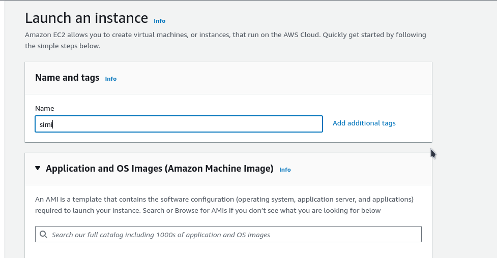

- Instance Type: t2.micro
- Operating System: Red Hat
- Storage: 80 GiB EBS volume

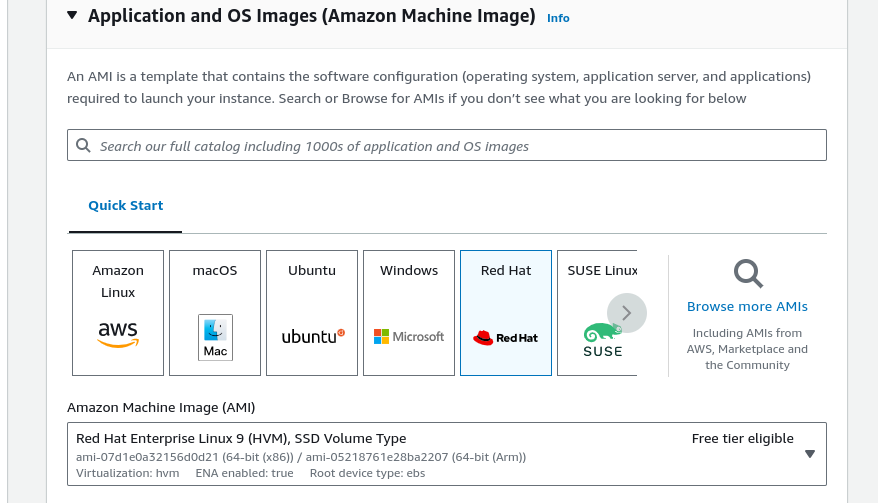


Now that our instance has been created we can now create and add our EBS volume to our running instance. for this project we'll be creating three EBS storage.

first we go to the create volume section we select create new volume and then do  setup like the one below

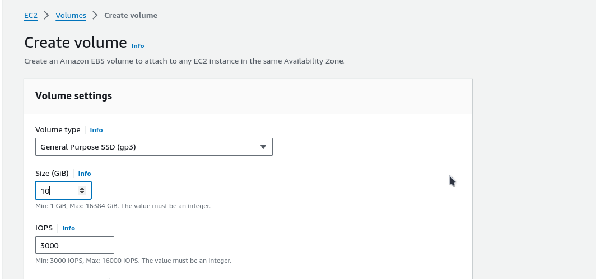

after creating our EBS volume we can now attach it too our instance. we right click on the created volume and then we see a drop down list we select the attach a volume option and then we picj our running server as ther
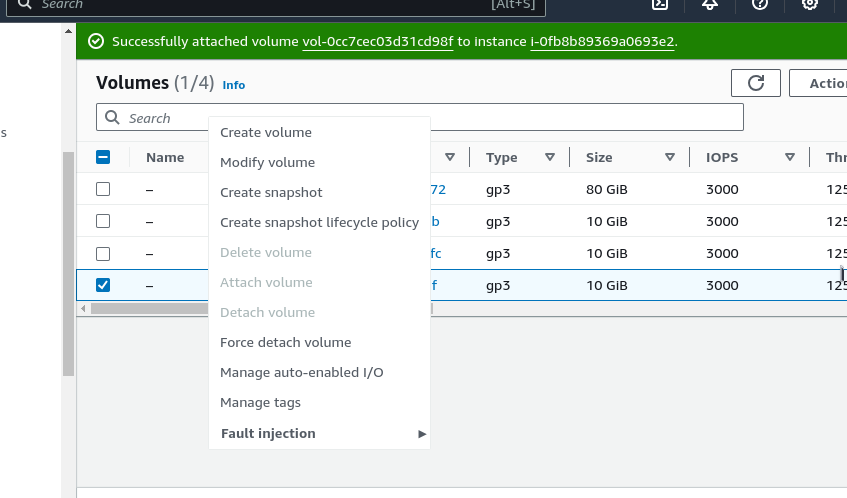

too connect too our RedHat server we are going too use the following command below

```bash
ssh -i <ssh-file>.pem ec2-user@<ip-public-address>
```

we can inspect what block devices are attached too our server by running the following command

```bash
lsblk
```

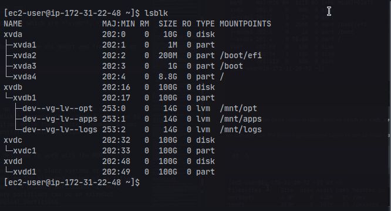

we can notice the three newly created devices which are **xvdf**, **xvdg**, **xvdh**

we can also use the following command below to see all mount and free space on our server

```bash
df -h
```
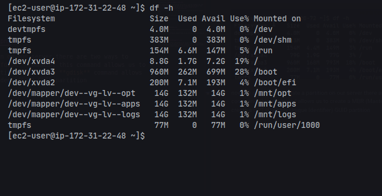

now we are going to create a partition on our server there are two ways to create a partition. we can use the **fdisk** command, this command allows us to create a MBR (Master Boot Record) partition while the **gdisk** command allows us to create a GPT (Globally Unique Identifier) GUID partition

### partitioning disk
For this project we are going to be using gdisk for partitioning. and we'll start by running the following command in the below image below

```bash
sudo gdisk /dev/xvdb
```

```
[ec2-user@ip-172-31-20-72 ~]$ sudo gdisk /dev/xvdg
GPT fdisk (gdisk) version 1.0.7

Partition table scan:
  MBR: not present
  BSD: not present
  APM: not present
  GPT: not present

Creating new GPT entries in memory.

Command (? for help): p
Disk /dev/xvdg: 20971520 sectors, 10.0 GiB
Sector size (logical/physical): 512/512 bytes
Disk identifier (GUID): A9FDA776-9256-41B9-8F80-84E82ED74D9A
Partition table holds up to 128 entries
Main partition table begins at sector 2 and ends at sector 33
First usable sector is 34, last usable sector is 20971486
Partitions will be aligned on 2048-sector boundaries
Total free space is 20971453 sectors (10.0 GiB)

Number  Start (sector)    End (sector)  Size       Code  Name

Command (? for help): n
Partition number (1-128, default 1): 1
First sector (34-20971486, default = 2048) or {+-}size{KMGTP}:  
Last sector (2048-20971486, default = 20971486) or {+-}size{KMGTP}: +2G
Current type is 8300 (Linux filesystem)
Hex code or GUID (L to show codes, Enter = 8300): 
Changed type of partition to 'Linux filesystem'

Command (? for help): p
Disk /dev/xvdg: 20971520 sectors, 10.0 GiB
Sector size (logical/physical): 512/512 bytes
Disk identifier (GUID): A9FDA776-9256-41B9-8F80-84E82ED74D9A
Partition table holds up to 128 entries
Main partition table begins at sector 2 and ends at sector 33
First usable sector is 34, last usable sector is 20971486
Partitions will be aligned on 2048-sector boundaries
Total free space is 16777149 sectors (8.0 GiB)

Number  Start (sector)    End (sector)  Size       Code  Name
   1            2048         4196351   2.0 GiB     8300  Linux filesystem

Command (? for help): w

Final checks complete. About to write GPT data. THIS WILL OVERWRITE EXISTING
PARTITIONS!!

Do you want to proceed? (Y/N): Y
OK; writing new GUID partition table (GPT) to /dev/xvdg.
The operation has completed successfully.

```
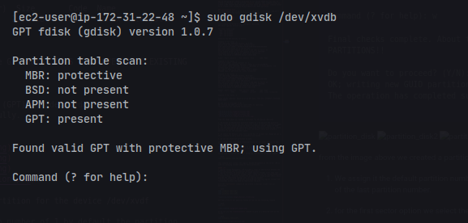
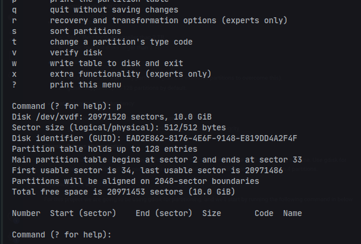
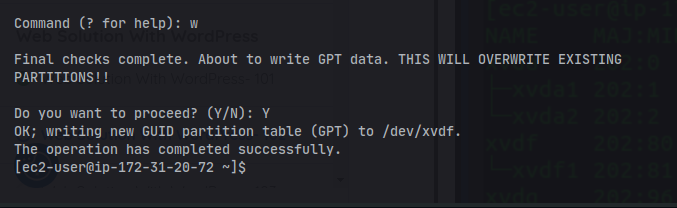

from the image above we created a partition for the device /dev/xvdf

1. We assign it the default partition number of 1 by default the partition number selected will be the next partition number of the last partition number.
2. for the first sector option we select the default sector number of 2048  
3. for the last sector we specified a 2GiB size this will allow us too create multiple partition on the device or else the default value will create a partition on all the available space.

4. we select the default linux file system but if we want too change we can use the L command to see a list of avvailble file system

5. we can now write our partition to save.

we reiterate this step while create partition for our other devices on the system.

we can now use ***lsblk*** command to see our newly configured partition
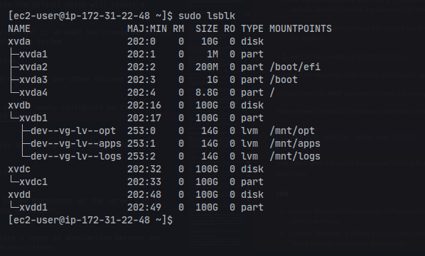


now we need to install lvm on our server by running the following command

```bash
sudo yum update; sudo yum install -y lvm2
```

that command will install the Logical Volume Management on the server LVM is used for managing volumes ontop of those partitions.

##### LVM
- Logical Volume Management: LVM provides a layer of abstraction between the operating system and the physical disks/partitions.
- Logical Volumes: It allows you to create logical volumes (LVs) that span across one or more physical volumes (PVs). These LVs can be resized dynamically.
- Volume Groups: Physical volumes are grouped into volume groups (VGs), which provide the underlying storage pool for logical volumes.
- Extends and Reduces: LVM allows extending and reducing logical volumes and filesystems without the need to repartition the disk.

with the **pvcreate** command we can create a physical volume from our partitions.

```bash
sudo pvcreate /dev/xvdb1
sudo pvcreate /dev/xvdc1
sudo pvcreate /dev/xvdd1
```

too see a list of our physical volume we can run the follwoing command

```bash
sudo pvs
```
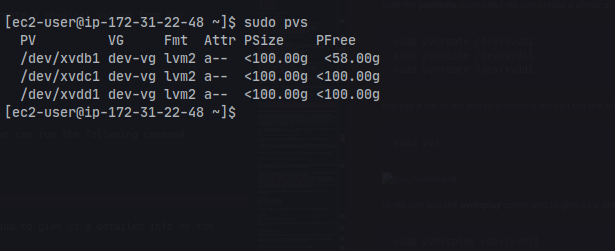

or we can use the ***pvdisplay*** command to give us a detailed info on the volume

```bash
sudo pvdisplay /dev/xvdf1
```
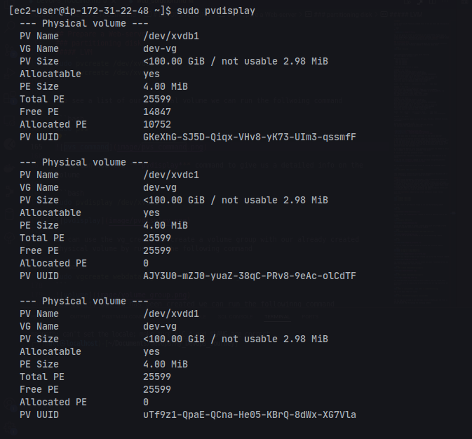

we can use the vg_create to create a volume group with our already created physical volume by running the following command

```bash
sudo vgcreate webdata-vg /dev/xvdb1 /dev/xvdc1 /dev/xvdd1
```
too verify out VG has been created we can run the followinng command

```bash
sudo vgs
```


now we can create our Logical Volume by running the following command

```bash
lvcreate -n lv-apps -L 14g webdata-vg
lvcreate -n lv-log -L 14g webdata-vg
lvcreate -n lv-opt -L 14g webdata-vg
```

to verify our logical volume as been created  we can run the following command

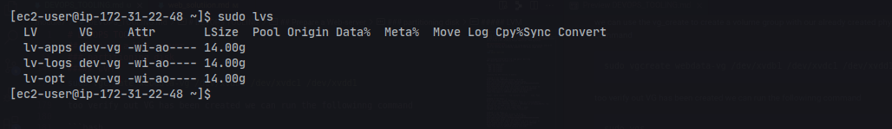

now that we have verified our logical volume have been created we can now use mkfs xfs file format the logical volumes

```bash
sudo mkfs -t xfs /dev/webdata-vg/lv-app
```

```bash
sudo mkfs -t xfs /dev/webdata-vg/lv-logs
```

our next objective is too create and mount folderes into our volume group

we'll start first by creating two directories one for our log and one for our html file

```bash
sudo mkdir -p /mnt/logs
```
now we can mount thhe file system

```bash
sudo mkdir -p /mnt/apps && sudo mount /dev/dev-vg/lv-apps /mnt/apps
sudo mkdir -p /mnt/logs && sudo mount /dev/dev-vg/lv-logs /mnt/logs
sudo mkdir -p /mnt/opt && sudo mount /dev/dev-vg/lv-opt /mnt/opt
```

#### updte /efc/fstab
now we need to update /etc/fstab file so  that the mount configuration will persist after restart of the server

we'll us the UUID of the device to update the /etc/fstab file
by running the following command

```bash
sudo blkid
```
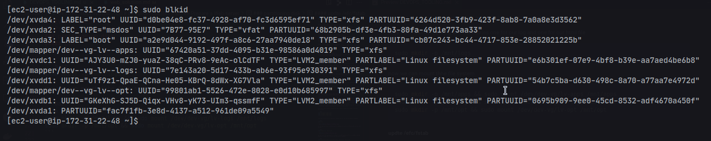

we are going to copy the UUID of the  ***/dev/mapper/dev--vg-lv--logs:*** and the UUID of the ***/dev/mapper/dev--vg-lv--apps*** and also 
***/dev/mapper/dev--vg-lv--opt*** into the /etc/fstab

```bash
sudo vi /etc/fstab
```

we'll write the follwoing code

```
UUID=d0be04e8-fc37-4928-af70-fc3d6595ef71       /       xfs     defaults        0       0
UUID=a2e9d044-9192-497f-a8c6-27aa7940de18       /boot   xfs     defaults        0       0
UUID=7B77-95E7  /boot/efi       vfat    defaults,uid=0,gid=0,umask=077,shortname=winnt  0       2
UUID=67420a51-37dd-4095-b31e-98586a0d4019 /mnt/apps xfs defaults 0 0
UUID=7e143a20-5d17-433b-ab6e-93f95e930391 /mnt/logs xfs defaults 0 0
UUID=99801ab1-5526-472e-8028-e0d10b685997 /mnt/opt xfs defaults 0 0
```
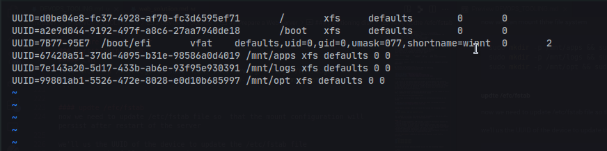

we save the file and then test the configuration daemon before restarting the server

```bash
sudo mount -a
```

and then we can restart the server by running the following coe

```bash
sudo systemctl daemon-reload
```

and now we can verify our setup by running df -h command


## install NFS server
 we need too install the nfs server on our instance by running the following command

```bash
sudo yum -y update
sudo yum install nfs-utils -y
sudo systemctl start nfs-server.service
sudo systemctl enable nfs-server.service
sudo systemctl status nfs-server.service
```

our next objective is too is too export mount all webservers to connects as client with subnet cidr this means we are going to install all three webservers inside of the same subnet.

we are going to startup by changing ownership of each mount folders

```bash
sudo chown -R ec2-user: /mnt/apps
sudo chown -R ec2-user: /mnt/logs
sudo chown -R ec2-user: /mnt/opt
sudo chmod -R 777 /mnt/apps
sudo chmod -R 777 /mnt/logs
sudo chmod -R 777 /mnt/opt
```

now we are going to configure access to NFS client on the same subnet by runngin the follwoinig command

```
/mnt/apps <Subnet-CIDR>(rw,sync,no_all_squash,no_root_squash)
/mnt/logs <Subnet-CIDR>(rw,sync,no_all_squash,no_root_squash)
/mnt/opt <Subnet-CIDR>(rw,sync,no_all_squash,no_root_squash)

sudo exportfs -arv
```
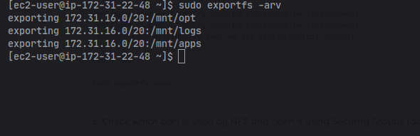

we need to check which port is run by nfs by running the following command
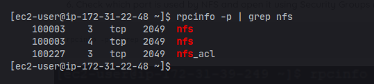

in order for NFS server to be accesible by our client we need too open this three port in our aws security group
- **TCP 111**
- **UDP 111**
- **UDP 2049**
- **TCP 2049**

the TCP 2049 is nfs default port running on our server

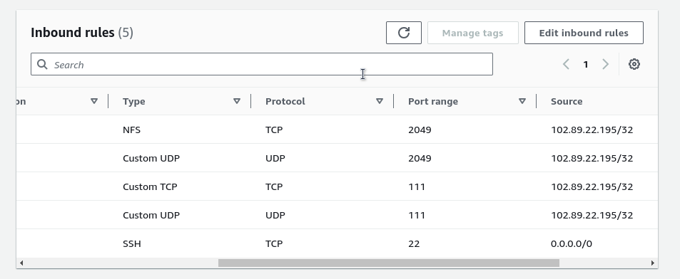


## setup database server

for this module we are going to setup a new Redhat instance that will host our MySQL server.
1. on the new instance server we need too install MySQl-server by running the following code
```bash
sudo yum install -y mysql-server
```

2. after installing the new sql server we need to create a new user and database by writting the following code
```bash
sudo mysql
```
```sql
CREATE DATABASE tooling;
CREATE USER 'webaccess'@'<webserver-private-IPAddress>' IDENTIFIED BY '<password>';
GRANT ALL ON toolings.* TO 'webaccess'@'<webserver-private-IPAddress>';
```
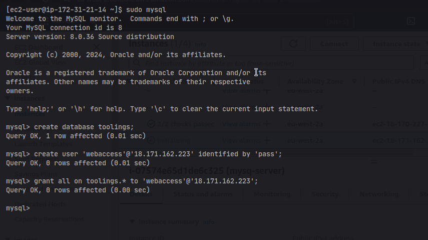

### Web Servers Configuration with NFS and MySQL Integration
To ensure our web servers can serve the same content from shared storage solutions like an NFS Server and MySQL database, we need to follow a series of steps. This approach will help make our web servers stateless, allowing us to add or remove servers as needed while preserving data integrity in both the database and NFS. Below is a summary of the steps required to set up this system:

Steps to Configure NFS Client and Deploy the Tooling Application
1. Launch a New EC2 Instance with RHEL 8 OS

2. Install NFS Client

```bash
sudo yum install nfs-utils nfs4-acl-tools -y
```
3. Mount /var/www/ and Target the NFS Server's Export for Apps
```bash
sudo mkdir /var/www
sudo mount -t nfs -o rw,nosuid <NFS-Server-Private-IPAddress>:/mnt/apps /var/www
```

- Verify the NFS mount
```bash
df -h
```

- Ensure changes persist after reboot by editing /etc/fstab by writing the following
```bash
sudo vi /etc/fstab
<NFS-Server-Private-IP-Address>:/mnt/apps /var/www nfs defaults 0 0
```

4. Install Remi's Repository, Apache, and PHP by running the following code
```bash
sudo yum install httpd -y
sudo dnf install https://dl.fedoraproject.org/pub/epel/epel-release-latest-8.noarch.rpm
sudo dnf install dnf-utils http://rpms.remirepo.net/enterprise/remi-release-8.rpm
sudo dnf module reset php
sudo dnf module enable php:remi-7.4
sudo dnf install php php-opcache php-gd php-curl php-mysqlnd
sudo systemctl start php-fpm
sudo systemctl enable php-fpm
setsebool -P httpd_execmem 1
```
5. Verify NFS Mount
- Check that Apache files and directories are available on the web server at /var/www and on the NFS server at /mnt/apps.
- Create a test file and ensure it is accessible from other web servers
```
touch /var/www/test.txt
```
6. now we are going to mount log folder to NFS by following the step below
```bash
sudo mount -t nfs -o rw,nosuid <NFS-Server-Private-IPAddress>:/mnt/logs /var/log/httpd
```
Ensure the changes persist after reboot by editing /etc/fstab
```bash
sudo vi /etc/fstab
<NFS-Server-Private-IP-Address>:/mnt/logs /var/log/httpd nfs defaults 0 0
```
9. TCP port 80 has been opened during instance deployment

10. Update Website Configuration to Connect to the Database
Modify the configuration file in /var/www/html/functions.php to connect to the MySQL database:

```php
<?php
$servername = "<database-private-ip>";
$username = "webaccesss";
$password = "<db-password>";
$dbname = "tooling";

// Create connection
$conn = new mysqli($servername, $username, $password, $dbname);

// Check connection
if ($conn->connect_error) {
    die("Connection failed: " . $conn->connect_error);
}
?>
```
11. Create a New Admin User in MySQL
Create a new admin user with the following SQL command:
```sql
INSERT INTO 'users' ('id', 'username', 'password', 'email', 'user_type', 'status') VALUES 
(1, 'myuser', '5f4dcc3b5aa765d61d8327deb882cf99', 'user@mail.com', 'admin', '1');
```

12. now we can access  the website in our browser at http://<Web-Server-Public-IPAddress-or-Public-DNS-Name>/index.php and log in using the credentials for myuse


